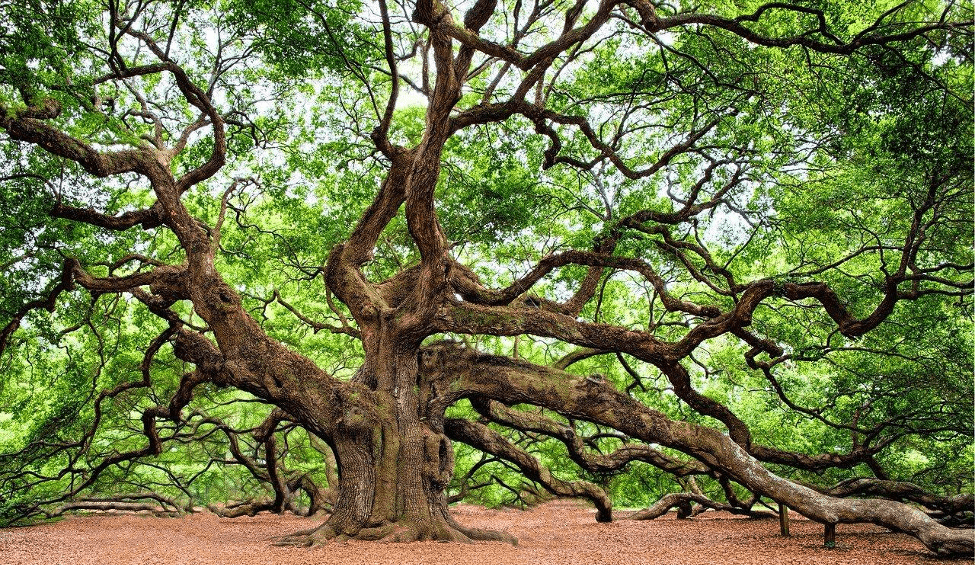
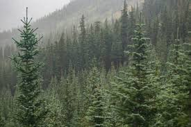

Welcome to **TreeLife**,your guide to learning about the beauty,diversity,and importance of trees around the world.
## About Us
At **TreeLife**,we're passionate about forests and green living. 
Our mission is to:
- Educate people about the different types of trees.
- Promote sustainable forestry
- Encourage reforestation projects.
> " The best time to plant a tree was 20 years ago. The second best time is now" - *Chinese Proverb*
## Featured Trees 
### Oak Tree
**Scientific Name**:*Quercus robur**

Known for its strength and longevity, the oak is a symbol of endurance.


## Pine Tree 
**Scientific Name**:*Pinus*

Everygreen and aromatic,pine trees thrive in colder regions. 


## Tree Identification Tool
you can use this simple **JavaScript** function to identify a tree by its characteristics:

```
function  identify_tree(leaf_shape, region){
    if(leaf_shape=="needle"&& region=="cold"){
        return"Pine Tree"
    } else if(Leaf_shape=="broad"&& region=="temperate"){
        return "Oak Tree"
        {else}
        Return "Unknown Tree"
    }
}
console.log(identify_tree("needle", "cold"))
